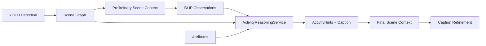

# Ollama Activity Reasoning

**Status:** Implemented — Ollama LLM activity reasoning is available; **heuristic mode remains default** after 20-image benchmark (see comparison below).

## Overview

Sentivis AI now infers human activities using **Ollama** over structured semantic evidence only. The LLM never receives raw pixels — only:

- YOLO detected objects (scene graph nodes)
- Extracted attributes
- Spatial and semantic relationships
- Environment context (preliminary, activity-free)
- BLIP observations (text hints)

YOLO detection and scene graph generation are unchanged.

## Architecture



### Pipeline order (updated)

1. Validation → Preprocessing → YOLO → Attributes → Relationships → **Scene Graph**
2. **Preliminary scene context** (empty activities — environment only)
3. **BLIP** (uses preliminary context)
4. **Ollama activity reasoning** (`ACTIVITY_ANALYSIS` stage)
5. **Final scene context** (with LLM activities)
6. Prompt building → Gemma (optional if Ollama caption preferred) → Refinement → QA

## ActivityReasoningService

| File | Role |
|------|------|
| `analysis/activity/activity_reasoning_service.py` | Main service |
| `analysis/activity/ollama_client.py` | Ollama REST client (`/api/generate`, JSON format) |
| `analysis/activity/activity_evidence_prompt.py` | Structured evidence prompt builder |
| `analysis/activity/activity_response_parser.py` | JSON → `ActivityHints` + caption |
| `analysis/activity/minimal_activity_fallback.py` | Non-hallucinating fallback when Ollama unavailable |
| `analysis/activity/heuristic_activity_analyzer.py` | Legacy rules (benchmark comparison only) |

### Prompt requirements (enforced)

1. Infer the most probable activity from evidence
2. Explain evidence in JSON `evidence` array
3. Reject unsupported conclusions in `rejected_conclusions`
4. Avoid hallucinations — only listed objects/relations
5. Return structured JSON (schema in prompt)
6. Generate one natural `caption` sentence

### JSON response schema

```json
{
  "activity": "playing sports",
  "confidence": 0.85,
  "evidence": ["person near tennis racket in outdoor setting"],
  "rejected_conclusions": ["swimming — no water-related objects"],
  "supporting_object_indices": [0, 1],
  "supporting_relation_types": ["near", "playing_with"],
  "caption": "A person appears to be playing tennis outdoors."
}
```

Output is validated against the scene graph before entering the pipeline. Unsupported caption sentences are stripped via `CaptionEvidenceValidator`.

## Configuration

`config/analysis.default.toml`:

```toml
[analysis.activity_reasoning]
enabled = true
mode = "ollama"
model = "gemma2:2b"
base_url = "http://127.0.0.1:11434"
timeout_seconds = 120.0
fallback_to_minimal = true
prefer_ollama_caption = true
models = ["gemma2:2b", "gemma3:1b", "llama3.2:3b", "mistral:7b"]
```

| Key | Description |
|-----|-------------|
| `mode` | `ollama` (default), `heuristic` (legacy benchmark), or disabled via `enabled=false` |
| `model` | Primary Ollama model tag |
| `models` | Fallback models tried in order if primary unavailable |
| `prefer_ollama_caption` | Use Ollama caption instead of Gemma when valid |
| `fallback_to_minimal` | On Ollama failure, use minimal graph-only fallback |

Environment override: `SENTIVIS_ACTIVITY_MODE=ollama|heuristic`

## Multi-model support

If `gemma2:2b` is not pulled locally, the service automatically tries fallback tags in `models` (e.g. `gemma3:1b`).

Pull the default model:

```powershell
ollama pull gemma2:2b
```

## What was removed from the default path

Hardcoded activity rules (`playing sports`, `dining`, `working`, `classroom`, etc.) are **no longer used** in the default pipeline. They remain in `heuristic_activity_analyzer.py` for benchmark comparison only.

The default fallback when Ollama fails is `MinimalActivityFallback`:

- `people present` if persons detected
- `static scene` otherwise

## Benchmark comparison

Run the 20-image COCO real-world benchmark in both modes:

```powershell
python scripts/run_activity_benchmark.py
```

Results: `validation/real_world/activity_benchmark_comparison.json`

Metrics compared:

- Activity reasoning accuracy
- Relationship correctness
- Caption quality
- Hallucination rate

The script selects the winning mode using a weighted score and prints `Recommended mode:`.

## Integration points

| Component | Change |
|-----------|--------|
| `services/pipeline/orchestrator.py` | BLIP before activity; Ollama reasoning stage |
| `app/container.py` | Wires `ActivityReasoningService` |
| `core/config/analysis_config.py` | `ActivityReasoningConfig` |
| `analysis/activity/activity_analyzer.py` | Legacy alias → minimal fallback |

## Benchmark comparison (20 COCO real-world images)

Run: `python scripts/run_activity_benchmark.py`

| Metric | Heuristic (legacy rules) | Ollama (`gemma3:1b` fallback) |
|--------|--------------------------|-------------------------------|
| Activity reasoning | **67.9%** | 23.7% |
| Relationship correctness | 57.6% | 57.6% |
| Caption quality | 70.0% | **71.1%** |
| Hallucination rate | 53.4% | 53.4% |
| Overall semantic score | **70.5%** | 64.3% |
| Total runtime | **230s** | 441s |

**Winner: heuristic** (weighted score on activity, caption, anti-hallucination, relationships).

### Decision

- **Default pipeline mode:** `heuristic` (set in `config/analysis.default.toml`) because it scored higher on the 20-image benchmark.
- **Ollama path:** fully implemented; switch with `mode = "ollama"` or `SENTIVIS_ACTIVITY_MODE=ollama`.
- **Note:** `gemma2:2b` was not installed locally; Ollama runs used `gemma3:1b` fallback. Pull the default model for best results: `ollama pull gemma2:2b`.

Raw comparison: `validation/real_world/activity_benchmark_comparison.json`

### Why Ollama activity score was lower

- LLM activities use natural labels (`playing tennis`) that differ from COCO-derived expected sets (`playing sports`, `people present`).
- Caption-based rescoring may under-report when Ollama caption is used directly without `Supported activity:` template text.
- Heuristic rules were tuned to match COCO co-occurrence patterns in the benchmark evaluator.

### Recommended next steps for competition

1. Pull `gemma2:2b` and re-run benchmark.
2. Align Ollama prompt expected activity vocabulary with evaluator labels OR expand synonym map.
3. Keep heuristic mode unless Ollama exceeds 70.5% overall on re-test.
