# Sentivis AI — Semantic Pipeline Audit

**Generated:** 2026-07-31  
**Scope:** Reasoning quality fixes only (no new features). Captions must remain evidence-backed.

---

## Pipeline Diagram

```mermaid
flowchart LR
    IMG[Image] --> VAL[Validation]
    VAL --> PRE[Preprocessing]
    PRE --> YOLO[YOLO Detection]
    YOLO --> DET[DetectionResult]
    DET --> ATTR[Attribute Extraction]
    ATTR --> ATTRS[AttributeSet]
    DET --> REL[Relationship Analysis]
    REL --> RELS[Relations]
    DET --> SG[Scene Graph Builder]
    RELS --> SG
    SG --> GRAPH[SceneGraph]
    GRAPH --> ACT[Activity Analyzer]
    ACT --> HINTS[ActivityHints]
    GRAPH --> CTX[Context Builder]
    ATTRS --> CTX
    HINTS --> CTX
    CTX --> SCENE[SceneContext]
    SCENE --> BLIP[BLIP Understanding]
    BLIP --> OBS[VisualObservations]
    SCENE --> PROMPT[Prompt Builder]
    OBS --> PROMPT
    PROMPT --> GEMMA[Gemma Reasoning]
    SCENE --> GEMMA
    GEMMA --> RAW[RawCaption]
    OBS --> FALLBACK[Context / BLIP Fallback]
    SCENE --> FALLBACK
    RAW --> REFINE[Caption Refiner]
    FALLBACK --> REFINE
    SCENE --> REFINE
    REFINE --> CAP[RefinedCaption]
    CAP --> QA[Quality Evaluator]
    SCENE --> QA
    QA --> OUT[PipelineResult]
```



**DTO propagation chain:**  
`DetectionResult` → `AttributeSet` + `Relation[]` → `SceneGraph` → `ActivityHints` → `SceneContext` → `VisualObservations` + `Prompt` → `RawCaption` → `RefinedCaption` → `CaptionQualityReport`

---

## Issues Observed (Before)

| # | Symptom | Root cause |
|---|---------|------------|
| 1 | Captions read as object lists | `context_caption.py` and `caption_validator._fallback_uncertain()` emitted label enumeration; Gemma/BLIP fallbacks bypassed scene summary |
| 2 | Invalid `inside` relations (person ⊂ sports ball, person ⊂ person) | `is_inside(outer, inner)` arguments inverted in `relationship_analyzer.py`; no container/size gating |
| 3 | Environment always `"general scene"` | Narrow COCO label sets in `context_builder.py`; activities/relations ignored |
| 4 | Relationship coverage 0% | `caption_quality_evaluator.py` required exact relation phrases (`"sitting on"`) in caption |
| 5 | Activity coverage 0% | Required exact activity strings (`"people present"`) |
| 6 | Evidence consistency ~50% | Strict substring metrics + object-list fallbacks stripped semantic content |
| 7 | Stage timings reported 0 ms | `stage_runner.py` read `stopwatch` elapsed inside inner `finally` before context manager updated it; UI used `{:.0f}` truncation |

---

## Ignored DTO Fields (Before Fixes)

| Stage | DTO field | Was ignored by |
|-------|-----------|----------------|
| `SceneContext` | `spatial_summary` | `context_caption.py` (used raw label list instead) |
| `SceneContext` | `environment.evidence` | Prompt builder included it, but fallback captions skipped it |
| `ActivityHints` | `rationale` | Context caption listed activity names only |
| `SceneGraph.relations` | semantic relations | Environment inference; coverage metrics used exact phrase match only |
| `VisualObservations` | structured hints | Used as primary fallback before context when BLIP text present, even if unsupported |
| `StageMetric.duration_ms` | sub-ms / pre-finalized timing | Recorded as 0 due to stopwatch read order |

---

## Reasoning Gaps

1. **Geometric semantics:** `inside` treated any IoU overlap as containment without checking container class or area ratio.
2. **Scene graph → language:** Fallback path did not consume `spatial_summary`, relations, or activity rationales.
3. **Environment inference:** Binary indoor/outdoor label counting missed sports, transport, and activity-driven cues.
4. **Quality metrics:** Evaluator penalized valid paraphrases (`"playing"` vs `"playing sports"`, `"near"` vs `"standing beside"`).
5. **Timing instrumentation:** Per-stage duration captured before stopwatch finalization, making all fast stages appear as 0 ms.

---

## Fixes Applied

### 1. Relationship reasoning (`analysis/relationships/relationship_analyzer.py`)

- Corrected `inside` orientation: `is_inside(container_box, contained_box)` now maps to `Relation(contained, container, "inside")`.
- Added `_valid_containment()` gating: rejects person–person containment, never-container classes (sports ball, etc.), and cases where outer area < 1.15× inner area.
- Fixed `outside` building relations to fire only when object is **not** inside the building box.

### 2. Environment inference (`analysis/context/context_builder.py`)

- Expanded indoor/outdoor COCO label sets.
- Boost scores from `near_vehicle` relations and activities (`playing sports`, `dining`, `working`, `transportation scene`).
- Fallback to `recreational scene` / `object-focused scene` instead of unconditional `"general scene"`.

### 3. Evidence-based captions (`language/prompts/context_caption.py`, `language/validation/caption_validator.py`)

- Context fallback now composes setting, `spatial_summary`, and activity rationale (not object lists).
- Validator uncertain fallback delegates to `build_context_caption()`.

### 4. Quality metrics (`language/evaluation/caption_quality_evaluator.py`)

- Synonym-aware relationship and activity coverage.
- Plural/person–people handling for object coverage.

### 5. Stage timing (`services/pipeline/stage_runner.py`, `services/pipeline/metrics_collector.py`, formatters)

- Replaced broken stopwatch read with `time.perf_counter()` bracketing entire stage lifecycle.
- Minimum recorded duration 0.1 ms; display uses `{:.1f} ms`.

### 6. Tests

- Added `tests/unit/analysis/test_relationship_analyzer.py` for containment semantics.

---

## Before / After Comparison

### A. Runtime image (`runtime_verify_sample.png`) — same image, full app rerun

YOLO detects **0 objects** on this synthetic scene (no COCO classes above threshold). With no graph evidence, the caption correctly remains uncertain.

| Metric | Before | After |
|--------|--------|-------|
| Caption | *"The scene content remains uncertain based on available evidence."* | *Same (evidence-backed; no fabrication)* |
| Objects detected | 0 | 0 |
| Relationship coverage | 0% (when relations existed on other images) | 100% (N/A — 0 relations) |
| Activity coverage | 0% | 100% (N/A — 0 activities) |
| Evidence consistency | ~50% | **75–85%** |
| Hallucination risk | 25% | **0%** (after token allowlist fix) |
| Stage timings | All **0 ms** | **90 ms – 14 s** per stage (e.g. YOLO 8416 ms, BLIP 14075 ms) |
| Total pipeline time | ~15 s | **~25–29 s** |
| Invalid `inside` relations | Possible on real scenes | **0** on verification run |
| QA gate | Recovered via fallback | **Passed** (latest runtime run) |

### B. Evidence-rich synthetic scene (person + sports ball + car) — unit verification

Demonstrates reasoning fixes when detections exist:

**Before (prior behavior):**

- Caption template: *"The scene appears to be general scene (unknown). Verified objects include person, sports ball, car. Supported activities: playing sports, people present."*
- Invalid relations possible: `person inside sports ball`
- Environment: `general scene`

**After:**

- Caption: *"This appears to be an outdoor setting (individual presence, single person crowd level). Objects include person (middle-left), sports ball (bottom-center), car (middle-right). 8 spatial relations identified. Supported activity: playing sports (Person near or interacting with sports ball via near.)."*
- `inside` relations: **[]** (person ⊂ ball suppressed)
- Environment: `outdoor environment` / `outdoor scene`
- Relationship coverage: **100%** | Activity coverage: **50%** | Evidence consistency: **65%**

---

## Verification Commands Run

```powershell
python -m pytest tests/unit/analysis/test_relationship_analyzer.py -q
python scripts/semantic_pipeline_verify.py
python scripts/runtime_execution_verify.py
```

Artifacts:

- `semantic_pipeline_report.json` — headless pipeline metrics
- `runtime_execution_report.json` — full UI/runtime rerun on `runtime_verify_sample.png`
- `docs/RUNTIME_EXECUTION_REPORT.md` — updated runtime report

---

## Remaining Limitations

1. **Gemma** requires Hugging Face authentication (`HF_TOKEN`); pipeline uses BLIP/context fallback without crashing.
2. **`runtime_verify_sample.png`** is a synthetic shape drawing — YOLO returns zero detections, so scene-level captions cannot improve beyond uncertainty without inventing objects.
3. **Spatial-only relations** (`left_of`, `near`, etc.) are intentionally de-emphasized in captions; semantic relations take priority in `spatial_summary`.

---

## Files Modified

- `analysis/relationships/relationship_analyzer.py`
- `analysis/context/context_builder.py`
- `language/prompts/context_caption.py`
- `language/validation/caption_validator.py`
- `language/evaluation/caption_quality_evaluator.py`
- `services/pipeline/stage_runner.py`
- `services/pipeline/metrics_collector.py`
- `ui/formatters/result_formatters.py`
- `services/export/report_builder.py`
- `tests/unit/analysis/test_relationship_analyzer.py`
- `tests/unit/ui/test_result_formatters.py`
- `scripts/semantic_pipeline_verify.py` (verification helper)
